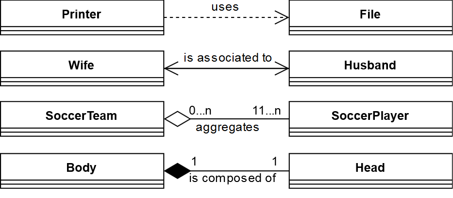

<!--NOTE HEAD START-->
<link rel="icon" type="image/png" href="./imgs/favicon_db.png" />

<!--NOTE HEAD END-->

## OOP
### Vocabulary
#### FR/EN

|EN|FR|
|--|--|
|override|redéfinir/spécialiser|
|overload|surcharger|

#### Associations: Dependency-Aggregation-Composition

Note for *Ambiguous, Aggregation and Composition associations*: 
- **Navigation**: Pointing from *A* to *B* with an arrow head means that you can **navigate** from *A* to *B* (here `wife.getHusband()` & `husband.getWife()`).
- **Cardinality**: putting numbers/ranges (*1*, *10*, *2...n*) at the end of a link specifies the cardinality of the relationship.

|Intensity of the relationship|Name|Description|
|--|--|--|
|Weakest|**Dependency Association**|When *A* uses *B* for some operation (here `printer.print(file)`)|
||**Ambiguous Association**|When *A* and *B* are linked by some reference holding but you don't want to be more specific.|
||**Aggregation Association**|When *A* holds a reference to *B* but *B* has its own purpose outside *A* context (Deletion of *A* does not imply deletion of *B*). There is no constraint about the cardinality of the *aggregate* end of the link, allowing *many-to-many* relationship. *Components* can be shared among different *aggregates* (A soccer player can be both in his club or in the national team).|
|Strongest|**Composition Association**|When *A* holds a reference to *B* but *B* has no purpose outside *A* context (Deletion of *A* implies deletion of *B*). *A* is called **the whole**. The cardinality of the *whole* end of the link must be 1, meaning that *components* cannot be shared among different *wholes* (a head cannot be part of two bodies).|

This split is sometimes really arbitrary and discussable: 
- A=Car, B=Engine: does the engine has a purpose without the car ? Well it migth depend on how generic it is built...

### relation between OOP basics & SOLID principles
-   OOP basics
    -   Encapsulation
    -   Abstraction
    -   Inheritance
    -   Polymorphism
-   SOLID
    -   Single Responsibility Principle
    -   Open / Closed Principle (note: solves the *Expression Problem*)
    -   Liskov Substitution Principle
    -   Interface Segregation Principle
    -   Dependency Inversion Principle)

Different purposes:
-   **languages or concepts which don't support Encapsulation, Abstraction, Inheritance and Poly _are not object oriented_**. If you do something object oriented you can always apply these OO basics, because they are available. One doesn't call such things principles.
-   SOLID in return is optional. When developing an OO design _you should strive to be SOLID, by applying the underlying basics_. **Solid only determines how "good" your design is**, not if it is object oriented or not. They are principles.

### SOLID
#### Dependency Inversion
Based on this idea, Robert C. Martin’s definition of the Dependency Inversion Principle consists of two parts:

1.  High-level modules should not depend on low-level modules. Both should depend on abstractions.
2.  Abstractions should not depend on details. Details should depend on abstractions.

### OOP basics

#### Encapsulation
Expose behavior in a public API that do calls to private behaviors implementations & attributes

### Best practices
#### Avoid fields direct use
*"You should not need to know if you are manipulating a field or a method"*

Direct access to a field `member` within a class must be avoided and you must prefer access it via getter/setter or other sort of private wrapping method `accessMember()`. This way if you further decide to replace the fields `member` by a method `member()`, the code changes implied by this change will only affect `accessMember()`.
#### Composition over inheritance
*"Inheritance is not for code reuse, inheritance is not for sharing behavior"*

Whenever you would have factorized some behavior with inheritance, if you can replace the **IS-A** relation by a **WITH-A** relation, you must use composition instead of inheritance.

*Help: Decorator Pattern, Bridge Pattern, Dependency Injection*.

#### When to transform final categorical attribute into inheritance ?
When some behaviors are only available based on a spécific attribute value.
For example:
This is ok:

graph TB
H[Human ____________ - final String sexe ____________  - void eatFruit]

  
This is NOT ok anymore, because added `giveBirth` method is only available if `Human.sexe.equals("woman")`:
  

graph TB
H[Human ____________ - sexe: String ____________  - void eatFruit  - Human giveBirth]

  
Need to be changed to:
  

graph BT
H[Human ____________  - void eatFruit ]
W[Woman ____________ ____________  - Human giveBirth]--extends-->H
M[Man ____________ ]--extends-->H

  

### Design patterns notes

|Name|Wiki-like definition|My understanding and notes|links with SOLID's principle|
|--:|:--:|:--:|:--:|
|**[Creational]** *Singleton*|**restricts the instantiation of a class to one "single" instance**. This is useful when exactly one object is needed to coordinate actions across the system. **anti pattern**: used in scenarios where it is not beneficial, introduces unnecessary restrictions in situations where a sole instance of a class is not actually required, and introduces global state into an application|[Best Java implem](https://stackoverflow.com/questions/70689/what-is-an-efficient-way-to-implement-a-singleton-pattern-in-java?rq=1): `public enum Foo{INSTANCE;}`. [Stackexchange](https://softwareengineering.stackexchange.com/a/40610): *"It's important to distinguish here between * **single instances** * and the Singleton design patter* **Single instances** * are simply a reality. Most apps are only designed to work with one configuration at a time, one UI at a time, one file system at a time, and so on. If there's a lot of state or data to be maintained, then certainly you would want to have just one instance and keep it alive as long as possible."*|Violates **OCP** because must be final class in order to guarantee singleton. Violates **DIP** because singleton class cannot implement an interface on which consumers can depend on, because the interface must be a logically describing a singleton (this point is discussable) and that it opens the possibility to extend it and have 2 instances of this singleton interface.|
|**[Creational]** *Builder Pattern*|*Aim's to provide a flexible solution to various object creation problems*|Useful when many construction parameters, to avoid unreadable ordered multiple arguments constructors. A builder patter for class C can be smoothly implemented with an inner class Builder & putting the C constructor private like this:`public C(Builder builder)`. Call: `C.Builder(mandatories...).setOptional().setOp... .build()`. It's a **Fluent Interface**|Commonly used Fluent interface can violate **OCP** because if the return type is exactly the class type, extensions may be forced to use every extended method before inherited ones in the chain. To avoid that, one can use [some generic tricks](https://stackoverflow.com/questions/17138552/java-generics-use-this-type-as-return-type) in *Java*, or simply set the return types to `this.type` in *Scala*.|
|**[Creational]** *Factory method Pattern*|*uses* **factory methods** *to deal with the problem of creating objects without having to specify the exact class of the object that will be created*|When a class *A* needing an instance of *IB* relies on its own factory method (returning type *IB*) to create instance of class implementing *IB* interface. Extension of *A* allows to overrides the factory method implementation, like the concrete class returned|Unlike Abstract factories, it may violate **SRP** because it puts the logic concerning creation of an instance of *IB* in the factory method of a class *A* that has its own purpose that is not instanciation of *B* objects. This complies with **OCP** because the extension of the creation behavior is elegant.|
|**[Creational]** *Abstract Factory Pattern*|*"provides a way to encapsulate a group of individual factories that have a common theme without specifying their concrete classes"*|It's a class whose **primary goal** is to expose factory method(s) returning *IB*. These methods behaviors may be overriden/implemented in subclasses (concrete factories). *(Also true for factory method pattern ->)* The concrete *B* subtype can depend on provided arguments, especially on an *Enum Type* (or Equivalent) argument on which factory can switch to decide which subclass of *C* to create. **The use of Enum Type parameter provide compile time safety for client** and it can also be charged to implement the logic of creation in Enum types methods (of course static). [Factory method vs Abstract Factory discussed](https://stackoverflow.com/questions/5739611/what-are-the-differences-between-abstract-factory-and-factory-design-patterns)|Complies smoothly with **DIP** because it allows client code to rely only on abstractions: abstraction of desired object *IB* (client is blind to concrete implementation and instanciation process) and abstraction of the Factory itself (concrete Factory can be passed as a Dependency Injection in constructor or setter of client class for example)|
|**[Creational]** *Prototype Pattern*|*"used when the type of objects to create is determined by a prototypical instance which is cloned to produce new objects"*|Useful when its worthy to copy the *Prototype* object content, when it has been costful to build it, or when many similar objects needs to be created (If it's juste to construct 1 new object using same parameters as the *Prototype*, *Builder Pattern* or factories can achieve it cleanly). The implem is often done with the *Clonable* interface in Java.|match **SRP** by delegating detail customizations of construction to client class of the Prototype.|
|**[Behavioral]** *Strategy Pattern* (=Policy Pattern)|*"the strategy pattern enables* **selecting an algorithm at runtime***"*|Encapsulate actual way to perform an action needed by an actioner in an actor. It's done by **abstracting different actor implementations into a base actor ready to be blindly manipulated by actioner**.|May help to comply with **SRP** (as actioner does **not have to know anything** **about** actual(runtime) action **implementation**) and **OCP** (as actioner class **has not to be modified** **when** adding new action implementation by **extending base actor**). Achieved by using Dependency injection of algorithm|
|**[Behavioral]** *Template method Pattern*|*"The template method is a method in a (abstract) superclass, and* **defines the skeleton of an operation in terms of a number of high-level steps** *(helper methods) for which subclasses are required to provide concrete implementations"*||Close execution of the DIP rule as it is **pushing as many logic as possible up on the class hierarchy tree**: Also help to **keep design DRY**|
|**[Behavioral]** *Visitor Pattern*|C'est une manière de séparer un algorithme d'une structure de données.||Usefull to comply with **OCP** because adding a new way to act an existing *Acceptor* doesn't imply to modify it, but only to add a new *Visitor*|
|**[Behavioral]** *Observer Pattern*|*"* **a subject** *(an object) maintains a list of its dependents, called* **observers** *, and notifies them automatically of any state changes, usually by calling one of their methods"*|Especially usefull in event-driven programming, for example for a game: Actions are performed by observers listening on a subject being for example the keyboard controller (a wrapper around it at least).|Perfect to comply with **SRP** because this way subject **has only to manage event notifications** and has not to perform any response action.|
|**[Behavioral]** *Command Pattern*|*"Encapsule la notion d'_invocation_. Il permet de séparer complètement le code initiateur de l'action, du code de l'action elle-même"*|*Client* pass to an Invoker (needing an *ICommand*, having *execute()* method) a *ConcreteCommand* that it has previously filled with a *Receiver* (object on which command will act) and parameters of the command. Might be useful to give client ability to chose action (Stored in *ConcreteCommand* object) to be performed by an *Invoker* at runtime. Might look close to a very specific *Observer Pattern*. [IO Monad can be seen as a Command in Command patterns](http://www.alexeyshmalko.com/2015/io-is-your-command-pattern/). |Match **SRP** because Invoker has not to know what it invokes. Keeps things **DRY** because slightly different request implementations directly done in invokers are now factorized by use of parameterized *Command* objects. **DIP** complient because *Invoker* relies only on *ICommand*.|
|**[Behavioral]** *State Pattern*|*"allows an object to alter its behavior when its internal state changes"*|Perfect to cleanly modelize Finite State Machines. A *Context* (=the Machine) object owns an *IState* instance `state` as attribute and will call `this.state.doSomething(this, ...)` when it needs to perform an action depending on its state. *Context* relies entirely on its state object to perform the action and also to possibly update its state with `context.setState(IState state)` method (it's why `this` is passed to `doSomething`). Good pratice: create *IState* and *ConcreteState*s as inner classes, so that `context.setState` can be private but still reachable by states.|Match **SRP** because *Context* blind to its State transitions and behaviors. Match **DIP** because *Context* depends only on *IState*. The inner classes solution should be avoided to perfectly match **OCP** by having extensions of *IState* not requireing *Context* recompilation.|
|**[Behavioral]** *Memento Pattern*|*"provides the ability to restore an object to its previous state, without violating its encapsulation."*|The *Originator* instances are rollbackable. They have `Memento saveToMemento(State s)` and `void restoreFromMemento(Memento m)` methods refering to a public static *Memento* inner class that has a method `State getSavedState()` **that is private and thus only accessible by outer class** ***Originator***. This way the client (*Caretaker*) can store *Originator* state in a *Memento* that is opaque to him and only readable by *Originator* class to rollback.|Match **SRP** because client has not to deal with details of rollback and *Originator*'s inner state, that would have also violated OOP basics' **encapsulation**.|
|**[Behavioral]** *Chain of responsability*|*"consisting of a source of command objects and a series of **processing objects**. Each processing object contains logic that defines the types of command objects that it can handle; the rest are passed to the next processing object in the chain. A mechanism also exists for adding new processing objects to the end of this chain"*|Useful when you have a *Sender* (client) and *Handlers* and the *Sender* **does not know to wich** ***Handler*** **pass a request** at compile time (that can be implemented with a *Command Pattern*) **or if it needs multiple** ***Handlers***** to handle it (the set of *Handlers* can also potentially **change dynamically at runtime**). A clear implem is having the *Sender* keeping a reference to 1 *Handler*, the head of the chain, and each *Handler* keeps a reference to the next one, forming a linked list structure. The query is passed through the chain and each *ConcreteHandler* answer the request **or not** and pass it down through the chain **or not**.|Match **DIP** because avoid tight coupling between *Sender* and potential corresponding *ConcreteReceiver*(s)|
|**[Structural]** *Adapter Pattern*|*"Also know as Wrapper [...], allows the interface of an existing class to be used as another interface"*|Implicit conversions in scala are a form of adapter pattern|The adapter might work as an abstraction over something, thus helping to comply with **DIP**|
|**[Structural]** *Bridge Pattern*|[SO](https://softwareengineering.stackexchange.com/questions/121326/understanding-the-bridge-design-pattern): *"Conceptually, you push the implementation details used by a class hierarchy into another object, typically with its own hierarchy. By doing so, you are removing a tight dependency on those implementation details and allowing the details of that implementation to change."*|It's an example of **Composition over inheritance**. You need to apply *Bridge pattern* when your design has been though too general for a class, i.e. when your sub-classes names contains too precise and too variable information, leading to a **"class explosion"**: For example when you have `City` base class extended in `TexasCity` and `FrenchCity` extended ni `BlueTexasCity` and `BlueFrenchCity` etc... It becomes an exponentially growing unreadable mess. You might want to use Only your `City` and pass a `Color` and `Localisation` (Enums for example) instances to it **via Dependency injection (this injection(s) are the bridge(s))** is the  in constructor for example. **[vs Strategy Pattern:]** *"I liken this to the use of a strategy pattern in the way you can plug in a new behavior. But instead of just wrapping an algorithm as is often seen in a strategy, the implementation object is usually more feature filled. And when you apply the concept to an entire class hierarchy the larger pattern becomes a Bridge."*|Match **SRP** in that it separate responsabilities (to pay taxes depending on the region, or how to maitain walls of a specific color) in different independant classes. Base class now relies on abstraction of color and localisation, matcing **DIP**|
|**[Structural]** *Facade Pattern*|*"serves as a front-facing interface masking more complex underlying or structural code"*|A *Facade* interacts  with a complex underlying library (many classes, well decoupled, matching SRP) and exposes a simplified context-specific API to client.|Breaks some SOLID principles (**OCP** and **DIP** in that it instanciates specific concrete classes and make hardcoded implementations choices impossible to extend) but can catalyze all the violations for the library it faces. Nice way to match **ISP** because of the context-specific focus.|
|**[Structural]** *Decorator Pattern*|*"Attaches additional responsibilities to an object dynamically keeping the same interface. Decorators provide a flexible alternative to subclassing for extending functionality"*|Prevent class explosion by allowing to create complex sets of behaviors at runtime. This need can be addressed by *Bridge Pattern* if the relations are 1-1 (City has 1 color), but if it's 1-n (Ice Cream may have many toppings), *Decorator* chaining is a great choice). The *Decorator* class **IS-A** and **HAS-A** *Component* (decorated class). The *Decorator* constructors requires **DI** of a *Component* (`public ConcreteDecorator(Component c)`), so the layers of decoration are forced to have at their core a standalone *ConcreteComponent* instance that is not a *Decorator*.|Match **SRP** because a *Decorator* is associated to each behavior addon. Class explosion can also be avoided by putting every potential behaviors as optional members in *Component*, activated or not at runtime. But this would have lead to violation of **OCP** (because adding potential behavior to *Component* requires its recompilation) and violation of **ISP** (because subclasses and client of *Component* will rely on many members being outside their concerns)|
|**[Structural]** *Proxy Pattern*|*"Provide a surrogate or placeholder for another object to control access to it."*|Like in *Decorator Pattern*, here the *Proxy* class **HAS-A** a *Subject* and **IS-A** *Subject* (so that it is transparent for the user to use either the *Proxy* or the *ConcreteSubject*). There is three flavours of proxies: 1. The **Remote Proxy**: Focusing on being a mediator (from a simple bypass to a more complex system with filtering or cache features) between a distant resource and the client. 2. The **Virtual Proxy**: Also referred as a sub-type of **Lazy Evaluation Pattern**. 3. The **Protection Proxy**: Focusing on rights management regarding access of the underlying resource.|Matches **SRP** in that the underlying resource has not to deal with its own high level efficient management. Matches **OCP** in that the choice to use or not or to change the Proxy implies only to change the concrete implementation of *Subject* class chosen.|
|**[Structural]** *Composite Pattern*|*"Compose objects into tree structures to represent part-whole hierarchies. Composite lets clients treat individual objects and compositions of objects uniformly."*|It's basically implemented as an **objects tree**. It is used to manipulate semmlessly a *Composite* or a *Leaf* object, both classes implementing a *Component* interface. *Composite* holds some *Component* objects and `composite.operation()` result is relying on `componentX.operation()` calls recursively propagated on the objects tree. `leaf.operation()` are base cases of the recursion.|Both client and the *Component*s have not to know about the whole tree structure to perform operations, thus matching **SRP**, and everybody relies on the *Component* abstraction, thus matching **DIP**.|
|**[Structural]** *Delegation Pattern*|*"Allows object composition to achieve the same code reuse as inheritance."*|When a method delegates its work to an underlying attribute. For example a `Body` can delegate walking to its `Legs`: its `.walk()` method simply call `this.legs.walk()`.|Useful to match **OCP** when we can't achieve behavior reuse through inheritance for some reason|

<!--stackedit_data:
eyJoaXN0b3J5IjpbMTYzNzE5OTI0Niw5Mjk4NzYwNzgsLTE3Nz
E4MTk0NjMsLTEwMTU0OTY4NDFdfQ==
-->