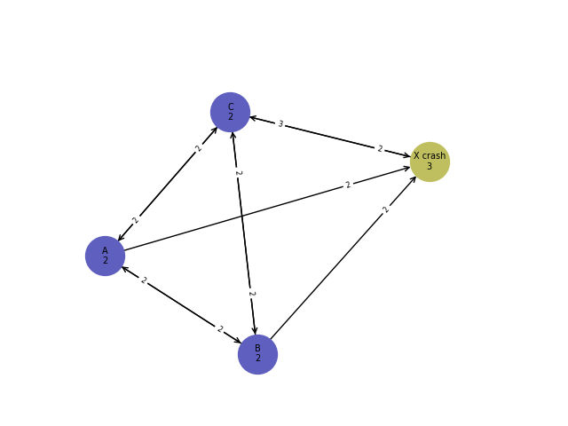
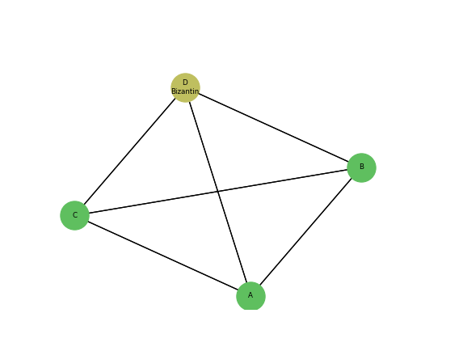
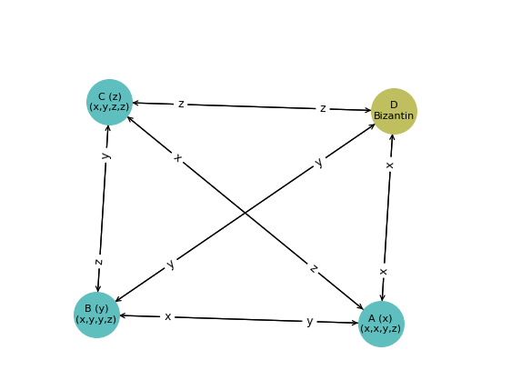
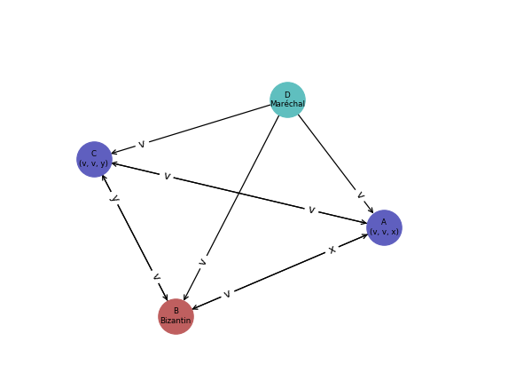
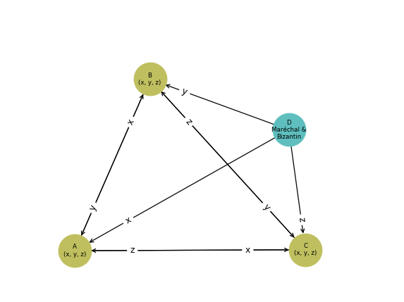

<link rel="icon" type="image/png" href="./imgs/favicon_db.png" />
<script src="https://cdnjs.cloudflare.com/ajax/libs/mermaid/8.0.0/mermaid.min.js"></script>
<script type="text/x-mathjax-config">
    MathJax.Hub.Config({
      tex2jax: {
        skipTags: ['script', 'noscript', 'style', 'textarea', 'pre'],
        inlineMath: [['$','$']]
      }
    });
  </script>
  <script src="https://cdn.mathjax.org/mathjax/latest/MathJax.js?config=TeX-AMS-MML_HTMLorMML" type="text/javascript"></script>


# Algorithmes distribués

### Caractéristiques typiques des systèmes distribués
1. Ils sont composés de plusieurs processus
2. Les processus communiquent par des messages
3. Ils ont des espaces de mémoire disjoints
4. Le système a une tache collective à réaliser

### Problèmes algorithmiques typiques
- Problèmes liés à la communication: routage, diffusion/collecte de données
- Problèmes liés au contrôle et à la coordination: élection de leader, exclusion mutuelle, construction de sous-topologies, détection de terminaison, équilibrage de charge, synchronisation
- Tolérance aux défaillances: consensus, détection et correction d'erreur, auto-stabilisation

### Modèle de système distribué synchrone
Chaque processus *i* est composé de:

- *States*$_i$ : Ensemble des états possibles
- *Starts$_i$ $\subseteq$ States$_i$* : Ensemble non vide d'états initiaux
- *out_neighbours<sub>i</sub>* et *in_neighbours<sub>i</sub>* : ensemble des voisins sortants/entrants du processus *i*
- *msgs$_i$* : Fonction de génération de messages
Le i-ème processus envoie un message:
**msgs<sub>i</sub> : States<sub>i</sub> x out_neighbours<sub>i</sub> $\rightarrow$ M $\cup$ {null}**
*M*=alphabet=ensemble de messages possibles
- *trans$_i$* : Fonction de transition d'état:
**trans<sub>i</sub> : States<sub>i</sub> x [M $\cup$ {null}]<sub>in_neighbours<sub>i</sub></sub> $\rightarrow$  States<sub>i</sub>**

__Notes:__

- *trans$_i$* est déterministe
- Chaque canal/lien peut contenir un seul message
- L'exécution commence quand chaque processus est dans le bon état initial et que tous les canaux sont vides
- L'exécution se déroule par round
Dans chaque round, chaque processus *i* :
  1. Applique *msgs<sub>i</sub>*  
  2. Reçoit les messages depuis les éléments de *in_neighbours<sub>i</sub>*
  3. Applique *trans<sub>i</sub>* sur l'état courant et les messages reçus pour changer d'état
  4. Supprime les messages dans les canaux (chaque processus *i* nettoie ses canaux entrant)
- Une exécution est une séquence infinie de rounds
C<sub>0</sub>M<sub>1</sub>C<sub>1</sub>...M<sub>r</sub>C<sub>r</sub> où C<sub>r</sub> est le vecteur des états de tous les processus, appelé configuration, obtenu à la suite du round *r* et M<sub>r</sub> est le multi-set de tous les messages qui étaient générés durant le round *r*
- La terminaison est atteinte lorsque les configurations ne changent plus (fonction de transition *trans<sub>i</sub>* ne change pas l'état de chaque processus *i*) et les canaux restent toujours vides.
- Un problème est un prédicat *P* sur les exécutions
- Un algorithme résout un problème si toutes les exécutions d'un système donné satisfont *P*
- Complexité en temps = Complexité en nombre de rounds avant la terminaison
- Complexité en mémoire/espace = $\vert States \vert$
- Complexité de communication = Complexité en nombre de messages
- Toutes les complexités sont à analyser dans le cas le pire

## 1. Problème d'élection de leader
### 1.1. Sur un Token Ring
#### Hypothèses
1. Anneau unidirectionnel SYNCHRONISÉ
2. Chaque processus a un identificateur unique (de l'ensemble UID de tous les identificateurs possibles)
3. L'anneau est orienté: Chaque processus connait le lien suivant dans le sens des aiguilles d'une montre, noté $lien_+$, et le lien inverse noté $lien_-$
#### Problème d'élection de leader
Supposons que chaque processus *i* a une variable nommée *état* tq,
 *état* $\in$ {leader, inconnu}
 A la terminaison de l'exécution d'un algorithme résolvant le problème, il faut qu'exactement 1 processus ait sa variable *état* à la valeur *leader*.
 Variante *(a)* du problème: Tout les processus sauf 1 seul se rendent compte qu'ils ne sont pas leader
  Variante *(b)* du problème: Pendant toute l'exécution il y a au plus un leader
### 1.1.1. Algorithme LCR (Lelann-Chang-Roberts)
*Alphabet*: *M* = UID = ensemble des id possibles

Pour tout processus *i*:
*States*$_i$ et *Start*$_i$:

- *u*: M, initialisée à l'id du processus *i*
- *état*: {leader, inconnu}, initialisé à *inconnu*
- msg: M $\cup$ {null}, initialisé à *u*
- *u<sub>max</sub>*: M, initialisée à *u*

*msgs*$_i$: 

- msgs<sub>i</sub> (lien<sub>+</sub>) = msg: le processus *i* génère un message avec le contenu *msg* sur le lien<sub>+</sub>

*trans*$_i$:
```fortran
msg := null
v := message reçu
Si u=/=null, on regarde v:
    cas v=u:
        état:=leader
        msg:=u
        u:=null
    cas v>umax:
        msg:=v
        umax:=v
    cas v=umax:
        état:=inconnu  !ou non_leader
        msg:=v
        !u:=null facultatif
```
Autre version (utilisée pour les calculs de complexité dans la partie suivante): on ne garde pas de u<sub>max</sub> mais le leader va envoyer un message spécifique pour signaler son élection, contenant son id ainsi qu'un tag leader.

#### Complexité du LCR 
*On ignore les n rounds/messages nécessaires pour que le processus élu leader l'annonce aux autres.*

| type | pire cas|meilleur cas|
|--|--|--|
|temps (rounds)| ~$2n$ rounds, soit $O(n)$ rounds |=|
|mémoire/processus|$O(1)$|=|
|communication (messages)|~$n\dfrac{n+1}{2}$, soit $O(n²)$: cas où les ids sont ordonnés par ordre décroissants|~$2n$, soit $O(n)$: ids ordonnés par ordre croissant|

Indication de preuve de correction:
Lèmme 1.1: Un processus *i<sub>max</sub>* (*i* est l'indice, pas l'id) avec id maximum, noté u<sub>max</sub>, passe son `état:=leader` à la fin du n<sup>ème</sup> round
Lèmme 1.2: $\forall$r tq 0 $\leq$ r $\leq$ n-1, après *r* rounds, msg<sub>(i<sub>max</sub> + r) mod n</sub> = u<sub>max</sub>, par récurrence sur *r*
Lèmme 2.1: $\forall$ processus *i* tq *i* $\neq$ *i<sub>max</sub>*, l'action `état:=leader` n'est jamais effectuée
Lèmme 2.2: $\exists$ un processus *j* $\in$ [i+1, i<sub>max</sub>], tq au round (*j* - *i*) mod n, msg<sub>j</sub> $\neq$ u<sub>i</sub>

### Théorème
Dans un anneau de taille n $>$ 1, si tous les processus sont identiques (même code, même nom) il n'existe pas un algorithme d'élection de leader même si *n* est connu et si l'anneau est bidirectionnel.

*Preuve*: Par l'absurde: Supposons qu'un tel algorithme existe. Considérons leur exécution: C<sub>0</sub>M<sub>1</sub>C<sub>1</sub>...
Tous les processus sont initialisés avec le même état *s<sub>0</sub>*.
Alors: à chaque round *r*: tous les processus prennent un nouvel état identique. Donc si au round *n* un leader a été élu, c'est que tous les processus sont leader, ce qui est interdit par l'énoncer du problème, donc l'algorithme résolvant le problème ne le résout pas: preuve par l'absurde qu'un tel algorithme n'existe pas !

### 1.1.2. Algorithme TS (Time Slice)

#### Hypothèse

  - Les processus connaissent la taille *n* de l'anneau
  
#### Description du déroulement

 - Le processus avec le plus petit identificateur est élu
 - Une exécution se compose d'une suite d'étapes
 - Chaque étape se composant de *n* rounds. 
 - Chaque étape est associée à la possible circulation d'un token véhiculant un UID autour de l'anneau: Seul le processus avec l'id *v* peut faire circuler son *id* durant l'étape *v*

Pour tout processus *i*:
*States*$_i$ et *Start*$_i$:

- *u*: M, initialisée à l'id du processus *i*
- *leader* $\in$ *UID* $\cup \{inconnu\}$, initialisé à *inconnu*
- msg: $M$$\cup$ $\{null\}$, initialisé à $null$


*msgs*$_i$: 

- msgs<sub>i</sub> (lien<sub>+</sub>) = msg: le processus *i* génère un message avec le contenu *msg* sur le lien<sub>+</sub>

*trans*$_i$:
```fortran
msg:=null
round:=round+1
Si round=n:
    round:=0
    étape:=étape+1
Si un message id_leader=/=u est reçu sur le lien_moins:
    leader:=id_leader 
    msg:=id_leader
Sinon:
    Si round=(v-1)n+1:
        leader:=u
        msg:=u
```


#### Variante: Élection du plus grand id
Attributs supplémentaires/modifiés dans *States*<sub>i</sub>:
-  *compteur_processus* $\in \mathbb{N}$, initialisé à $0$
- *ping*
- msg: $M$$\cup$ $\{null, ping\}$, initialisé à $null$

*trans*$_i$:
```fortran
msg:=null
Si leader=inconnu:
    round:=round+1
    Si round=n:
        round:=0
        étape:=étape+1
    Si un message ui est reçu sur le lien_moins:
        leader:=ui
        msg:=ui
    Sinon:
        Si un message ping est reçu sur le lien_moins:
            compteur_processus:=compteur_processus+1
            msg:=ping
        Si compteur_processus=n-1:
            leader:=u
            msg:=u
        Si round=(v-1)n+1:
            msg:=ping
```

#### Comparatif complexités

| type | id le plus petit | Variante: id le plus grand|
|--|--|--|
| temps (rounds)| $O(n.id_{min})$ |$n.id_{max-1}+distance\: entre\:processus_{id_{max}} et\: processus_{id_{max−1}} = O(n.id_{max−1}))$|
|mémoire/processus|$O(1)$|$O(1)$|
|communication (messages)|$O(n)$|$O(n^2)$|

*Note:* $id_{max-1}$ est le 2<sup>ème</sup> plus grand id.

### 1.1.3. Algorithme HS (Hirschberg-Sinclair)
#### Nouvelle Hypothèse
- Anneau __bidirectionnel__ de *n* processus (toujours pas de connaissance de *n*)

#### Fonctionnement
L'ensemble des messages contient les triplets composés d'un *id* $\in$ UID, d'un flag $\in$ {out, in}, et d'un entier positif *k* $\in \mathbb{N}$<sup>+</sup> qui est le compteur de sauts.
Un message $\in$ UID x {out, in} x $\mathbb{N}$<sup>+</sup>
$\forall$ processus *i*: 
States<sub>i</sub> & Starts<sub>i</sub> :

- u: UID, `u:=id` de *i*
- msg<sub>+</sub>: M $\cup$ {null}, `msg_plus:=(u, out, 1)`
- msg<sub>-</sub>: M $\cup$ {null}, `msg_moins:=(u, out, 1)`
- état: {inconnu, leader}; `état:=inconnu`
- phase $\in \mathbb{N}$, `phase:=0`

__msgs<sub>i</sub>__: renvoie *msg<sub>+</sub>* sur lien<sub>+</sub> et *msg<sub>-</sub>* sur lien<sub>-</sub>.
__trans<sub>i</sub>__: 
```fortran
msg_plus:=null; msg_moins:=null
Si le message reçu est (v, out, h) sur lien_moins alors:
    cas v>u et h>1: msg_plus:=(v, out, h-1)
    cas v>u et h=1: msg_moins:=(v, in, 1)
    cas v=u: état:=leader
Si le message reçu est (v, out, h) sur lien_plus alors:
    cas v>u et h>1: msg_moins:=(v, out, h-1)
    cas v>u et h=1: msg_plus:=(v, in, 1)
    cas v=u: état:=leader
Si le message reçu est (v, in, 1) sur lien_moins et v>u alors:
    !Comment: ici v!=u suffit puisque v<u impossible avec tag in
    msg_plus:=(v, in, 1)
Si le message reçu est (v, in, 1) sur lien_plus et v>u alors:
    !Comment: ici v!=u suffit puisque v<u impossible avec tag in
    msg_moins:=(v, in, 1)
Si le message reçu est (u, in, 1) sur les deux liens alors:
    phase:=phase + 1
    msg_plus:=(u, out, 2**phase)
    msg_moins:=(u, out, 2**phase) 
```
	
#### Complexité de l'algorithme HS 
##### En communication
Le processus *i* passe à la phase *l* ssi dans la phase précédente l-1 il n'y a pas de processus avec un id plus grand que *id<sub>i</sub>* parmis les processus à une distance $d = 2^{l-1}$ de *i*.
Au plus $\lfloor\dfrac{n}{2^{l-1}+1}\rfloor$ processus passent à la phase *l*.
Ils envoient au plus $2.2.2^{l}\lfloor\dfrac{n}{2^{l-1}+1}\rfloor = O(n)$ messages durant cette étape
Le nombre de phases est $O(log(n))$
$\Rightarrow$ complexité en messages = $O(n.log(n))$

##### En temps
$O(n.log(n))$ très grossièrement.
Analyse plus poussée:
Dans chaque phase *l*, chaque processus qui envoie les messages les envoie à la distance $2.2^{l}$ au plus:
$$2.(1+2+4+8+...+2^{O(log(n))}) \\
= 2.(2.\dfrac{1 - 2^{O(log(n))}}{-1} + 2^{O(log(n))}) \\
= O(2^{O(log(n))}) = O(n)$$

### 1.2. Sur un graphe connexe
#### Les Hypothèses
1. Graphe de communication connexe quelconque
2. Chaque processus a un identificateur unique (de l'ensemble UID de tous les identificateurs possibles)
3. Communication __synchronisée__
4. le diamètre du graphe est connu par les processus

#### Définitions
*Distance entre deux nœuds:* Longueur du plus court chemin entre deux nœuds.
*Diamètre d'un graphe:* Plus grande distance entre deux nœuds du graphe.

Pour chaque processus *i* (un processus par nœud)
States$_i$ & Starts$_i$:

- $u_i \in UID$, initialisé à l'id de *i*
- $u_{max_i}  \in UID$, initialisé à $u_i$
- $état \in \{inconnu, leader, nonleader\}$, initialisé à $inconnu$
- $round \in \mathbb{N}$, initialisé à $0$

*msgs$_i$*: Si $round < diamètre$, envoyer $u_{max_i}$ à tous les processus *j* voisins
 *trans$_i$*: 
```fortran
round:=round+1
Soit W l'ensemble des id reçus dans ce round
max_id:=MAX({max_id} + W)
Si round:=diametre alors:
    Si max_id=u alors état:=leader
Sinon état:=non_leader
```
#### Complexités
##### Communication
$Comp_{messages} = diametre.2.|E|$
avec $E$ = nombre d'arêtes
##### Temps
$Comp_{round} = diametre$

## 2. Problème de consensus sur un graphe complet
### Hypothèses
- Topologie complète (tous les processus sont reliés entre eux)
- *n* processus, *p<sub>i</sub>*, *i* $\in$ [1, ..., n] 
- Chaque processus a une valeur initiale $\in$ V , V=ensemble de valeurs fixe
### Problème d'accord/de consensus
1. *Agrément*: Deux processus ne se décident pas pour deux valeurs différentes.
2. *Validité*:  Si tous les processus ont la même valeur initiale *v*, alors *v* est la seule décision possible
3. *Terminaison*: Tout processus non-défaillant finit par décider une valeur

__/!\\__ La décision ne se fait qu'une seule fois !

*Notes:* Problème simple à résoudre si tout va bien, i.e. sans défaillance: On partage les valeur et on décide pour la valeur maximum ou la valeur la plus présente (avec max choisi si égalité) par exemple.

### 2.1. Consensus avec des défaillances d'arrêt (*crash*)
*Notes:*
- Les défaillances sont définitives
- *f* : nombre de défaillances
- *n* : le nombre de processus
- *f* $<$ *n*
- $U$ : ensemble de valeurs initiales *possibles* (pas forcément *prises*)
- $v_0 \in U$ : valeur pré-définie égale pour tous les processus (différent de la valeur initiale $u\in U$ échangée)

Exemple de crash problématique:



Le processus *X* va par exemple crasher (hypothèse: les crash sont définitifs) après n'avoir eu le temps d'envoyer sa valeur $v_0$ qu'au processus *C*. 
#### Théorème
Il est impossible de résoudre le problème de consensus dans un réseau __asynchrone__ pouvant subir des défaillances d'arrêt. 

*Asynchrone* = Il est impossible de borner le temps de parcours des messages

*Intuition du problème :* 
Les arrêtes sortantes du processus *x* sont très lentes et les autres processus vont décider avant de recevoir les messages de *x*.

Le problème se résout grâce à l'hypothèse f $<$ n (cf suite)

#### 2.1.1. Algorithme de FloodSet
Pour chaque processus *i*:
Les éléments de *M* (ensemble de messages possibles) sont des ensembles de valeur dans *U* (ensemble des valeurs initiales)
$M = \mathbb{P}(U)$
States$_i$ & Starts$_i$:

- $v_0 \in U$, identique pour tout les processus
- $rounds \in \mathbb{N}$, initialisé à *0*
- $décision \in U \cup \{inconnu\}$, initialisé à *inconnu*
- $W \subseteq U$, initialisé à `W:={valeur initiale du processus i}`

*msgs$_i$*: Si *rounds* $\leq$ *f* alors envoie *W* à tout les autres processus, sinon leur envoie *null*
*trans$_i$*: 
```fortran
rounds:=round+1
Soit Wj le message qui arrive du voisin j
Pour tout voisin j:
    W = Wj U W
Si (rounds = f+1) alors:
    Si |W|=1 alors:
        décision:=v tq W={v}
    Sinon:
        décision:=v0 
        !aurait pu être aussi le Max(W) 
        !par exemple si une valeur v0 commune n'était 
        !pas disponible
```
La correction de l'algorithme *FloodSet* repose sur 2 points principaux:
1. Parmi les *f+1* premiers rounds, au moins un est sans défaillances  (hypothèse $f<n$)
2. À  la fin d'un round sans défaillances, chaque processus correct obtient le même ensemble $W_2$ et à partir de ce round $\forall$ processus $i,  W_i$ ne change plus.


##### Complexité
$Comp_{rounds}\leq f+1 = O(f)$ messages

$Comp_{messages}\leq n.(n-1).(f+1) = O(fn²)$ messages

Chaque message inclus au maximum n valeurs ($|W|\leq n$) et chaque valeur de *b* bits
$Comp_{bits\:transmis} \leq n^3bf =  O(fn^3)$

#### 2.1.3. Algorithme de FloodSet optimisé

Pour chaque processus *i*:
Les éléments de *M* (ensemble de messages possibles) sont des ensembles de valeur dans *U* (ensemble des valeurs initiales)
$M = \mathbb{P}(U)$
States$_i$ & Starts$_i$:

- $v_0 \in U$, identique pour tout les processus
- $rounds \in \mathbb{N}$, initialisé à *0*
- $décision \in U \cup \{inconnu\}$, initialisé à *inconnu*
- $u \in U$, initialisé à `u:=valeur initiale du processus i`
- $W \subseteq U$, initialisé à `W:={u}`
- $done \in \{true, false\}$, initialisé à `done:=false`
- $msg \in U \cup \{null\}$, initialisé à `msg:=u`

*msgs$_i$*: *Envoyer msg à tous les voisins*
*trans$_i$*: 
```fortran
msg:=null
rounds:=round+1
Soit wj le message qui arrive du voisin j
Pour tout voisin j: 
    Ajoute w à W
Si (rounds = f+1) alors:
    Si |W|=1 alors:
        décision:=v tq W={v}
    Sinon:
        décision:=v0 
        !Contrairement au cas du floodset simple,
        !on ne peux pas remplacer cette ligne par décision:=Max(W) 
        !puisque les Wi peuvent être différents !
Sinon si |W|>1 et done=false:
    done:=true
    msg:=v, tq v appartient à W et v=/=w
    
```
L'idée est que la première fois où un processus reçoit une valeur différente de la sienne, il avertisse les *n* autres processus de cette valeur. Il n’envoie qu'une seule valeur (et pas un set) et cela, une unique fois (et pas à chaque round).

##### Comparatif de complexités

|Complexité|FloodSet simple|FloodSet optimisé  |
|--|--|--|
|$Comp_{rounds}$| $O(f)$ | $O(f)$ |
|$Comp_{messages}$| $O(fn^2)$ | $n.n$ messages sont envoyés au premier round, puis dans le pire cas (tous les processus n'ont pas le même u) tout les processus vont envoyer une fois de plus un message à chaque autre processus, d'où une complexité de:  $2n^2 = O(n^2)$ |
|$Comp_{bits\:transmis}$| $O(fn^3)$ | $2bn^2 = O(n^2)$ |

### 2.2. Consensus avec des défaillances Byzantines
#### Définition
Un processus présentant une **défaillance byzantin** est un processus que l'on considère libre d'adopter un comportement non conforme.
Les défaillances Byzantines sont plus générales que les défaillances d'arrêt
Une résolution avec défaillances Byzantines résout n'importe quel problème de défaillances d'arrêt __dans les mêmes conditions__

#### Problème
1. *Agrément*: Deux processus __non-défaillants__ ne se décident pas pour deux valeurs différentes.
2. *Validité*:  Si tous les processus __non-défaillants__ ont la même valeur initiale *v*, alors *v* est la seule décision possible
3. *Terminaison*: Tout processus __non-défaillants__ finit par décider une valeur


#### Théorème
Le problème du consensus Byzantin ne peut pas être résolu avec $f>\dfrac{n}{3}$ processus Byzantins

#### Exemple
$n=4, f=1$   $\:\:\:\:\:\:$ ($1<\dfrac{4}{3}$)


Considérons l'algorithme de consentement suivant:
States & Starts:

- $v_i \in V$, propre à chaque processus *i*
- $m_i \in V$, pas d'initialisation

*msgs$_i$*: envoyer $v_i$ à tous les processus, y compris *i*
 *trans$_i$*: 
```fortran
Si n messages reçus alors:  !y compris le message de i vers i
    Calculer la valeur majoritaire mi (la plus petite en cas d'=)
    vi:=mi
```
Voici un exemple de comportement du processus Bizantin qui casse cet algorithme: 

$\rightarrow$ Le Bizantin envoie des valeurs différentes aux trois autres processus.
$\rightarrow$ Ce comportement fait décider des valeurs différentes à *A*, *B* et *C* : $x \neq y \neq z$

#### 2.2.1. Diffusion Fiable avec maréchal
##### Hypothèse
- Il y a un *Maréchal* dans le système.

##### Déroulement
- **Lors du 1$^{er}$ round, le maréchal diffuse sa valeur à tous.** Si les processus reçoivent un message d'un autre processus que le maréchal durant cette phase, ils ignoreront ce message et considèreront l'auteur comme Bizantin. Si le maréchal reçoit des messages d'un autre processus durant cette phase, il l'ignorera et considérera l'auteur comme Bizantin.
- **Lors du 2$^{ème}$ round, chaque autre processus autre que le maréchal envoie sa valeur à tous les autres, sauf au maréchal.** Si le maréchal reçoit un message lors de cette phase, il l'ignorera et considèrera l'auteur du message comme Bizantin. Si les autres processus reçoivent un message du maréchal durant cette phase, ils l'ignoreront et considéreront le maréchal comme Bizantin.
- **À la fin du 2$^{ème}$ round, chaque processus décide la valeur médiane** parmi les valeurs dont il dispose.

*Note:* On considère que le processus Bizantin est obligé d'envoyer un et un seul message aux moments où il est sensé le faire pour ne pas révéler son dysfonctionnement aux autres.

On distingue deux cas pour intuiter de la solidité de ce scénario:
***Cas 1:*** Le maréchal n'est pas Bizantin

1. Le Bizantin est un processus lambda.
2. Le maréchal va envoyer le message *v* à *A*, *B* et *C*.
4. Le maréchal va tenter de casser le déroulement du consensus en envoyant des valeurs différentes *x* et *y* à *A* et *C*.
5. Au final *D* qui est maréchal décide de la valeur *v* dont il a réalisé la diffusion initialement. Les deux autres processus non défectueux décident également la valeur *v* qui est la valeur médiane dans le set de valeurs obtenu par chacun.


***Cas 2:*** Le maréchal est Bizantin

1. Le Bizantin est le processus maréchal.
2. Le maréchal va tenter de casser le déroulement du consensus en envoyant des valeurs différentes *x*, *y* et *z* à *A*, *B* et *C*.
4. Les processus *A*, *B* et *C* s'échangent ensuite leurs valeurs.
5. Les trois processus non défectueux *A*, *B* et *C* ont au final  des set de valeurs identiques et décident tous la même valeur médiane *y*.

#### 2.2.2. Diffusion Fiable sans maréchal
##### Hypothèse
- Nous supposerons maintenant qu'à la réception d'un message sur un canal, on a accès avec certitude à l'id du processus expéditeur
##### Déroulement
- **Lors du 1<sup>er</sup> round**, chaque processus *i* envoie à tous les autres processus sa valeur initiale, qu'il associe à l'$id$ de l'expéditeur, et reçoit les valeurs de tous les autres processus. Le processus ne prend en considération que le premier message reçu. 
- **Lors du 2<sup>ème</sup> round**, chaque processus *i* envoie à tous les autres processus un tuple de couples $(id_{i}\:, valeur_{i})$ et reçoit les tuples de couples provenant des autres processus, en ignorant si nécessaire les couples$(id_j, valeur_j)$ contenues dans le tuple envoyé par le processus $j$.
- **À la fin du 2<sup>ème</sup> round**, chaque processus $i$ attribut aux processus $j$ ($j\neq i$) la valeur strictement majoritaire parmi les couples $(id_j, valeur_j)$ contenus dans les tuples de couples reçu au round 2 (Si il n'y a pas de valeur strictement majoritaire, l'attribution n'est pas réalisée). Le processus $i$ décide alors la valeur strictement majoritaire parmi les valeurs attribuées (la plus petite en cas d'ex-æquo).

##### Complexités
$comp_{temps} = O(1)$
$comp_{messages} = O(n^2)$
$comp_{bits\:transmis} = O(n^3)$
$comp_{memoire/processus} = O(n)$

## 3. Diffusion d'information/Construction d'arbre BFS sur un graphe connexe
### Définition
*Arbre BFS (Breadth-First Search):* C'est un arbre couvrant possédant un nœud spécial nommé racine $r_0$ et tel que la distance de tout les nœuds avec $r_0$ est la même que dans le graphe sous-jacent 

Pour chaque processus *i* (un processus par nœud)
States$_i$ & Starts$_i$:

- $deja_vu \in \{true, false\}$, initialisé à $true$ pour $r_0$ et $false$ pour les autres nœuds
- $msg_i \in Strings \cup \{null\}$, initialisé à $"into"$ pour $r_0$ et $null$ pour les autres nœuds
- $pere_{i}  \in Canaux \cup \{null\}$, initialisé à $null$

*msgs$_i$*: envoyer $msg_i$ à tous les processus *j* voisins
 *trans$_i$*: 
```fortran
msg:=null
Si deja_vu=false et message m reçu sur le canal p:
    msg:=m
    deja_vu:=true
    pere:=p
```
### Complexités
#### Communication:
$Comp_{messages} = n.E(nombreDeVoisins)=2.\vert E\vert$
avec $n=nombreDeNœuds$

Dans le cas de l'optimisation *"On ne réponds pas à son père"*, $Comp_{messages}  = 2.\vert E\vert - (n-1)$

Dans le cas de l'optimisation *"On connait ses fils"*, $Comp_{messages}  = n- 1$
#### Temps:
$Comp_{round} = profondeur$

# 5. Références
Cours écrit par Enzo Bonnal et basé sur:
- Cours dispensés par J.Burman
- *Distributed Algorithms*, N. A. Lynch
